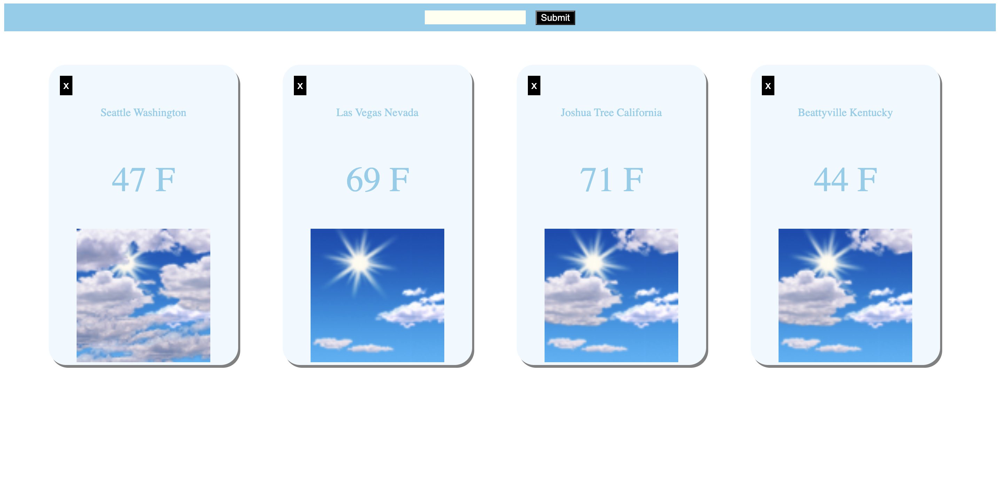

## WEATHER APP FINAL PROJECT
-------------------------

### CONTENTS OF THIS FILE
---------------------

* Description
* Requirements
* Installation

### DESCRIPTION
-----------

This weather app displays basic weather information to the user in an easy to read format. The user can enter in a location name to the search bar at the top of the page to initiate a search. The search will return a 'weather card' with the location name, temperature, and image of current forecast. Multiple locations can be displayed on multiple 'weather cards' and can be removed simply by hitting the 'x' button in the top left of the card. The user can hover over each individual card to magnify it for an easier to read display.

The app makes use of three different APIs to gather and display the information a user would find useful in a way that is designed for simplicity on the user side. 
While the user can simply type in the area name the app will run that name through an API that will return the coordinates, those coordinates are then passed into an API that return grid points, and that return is finally passed into a third API that displays daily weather data.

* For more details navigate to the following blog post:
  
  [Nested Fetch](https://medium.com/@shalitmontagne.g/nested-fetch-9c7774fd9592)

* To view the project please visit the page:

    https://raccoonnw.github.io/phase-1-final-project/

### REQUIREMENTS
------------
* Text Editor to write JavaScript, HTML, and CSS
* Modern browser to display and debug app

### INSTALLATION
------------
No special installations required. Follow directions to install your preferred text editor

### CONTRIBUTING
----------------

No Contributions are currently accepted

### PROJECT STATUS
------------------

This app was a project intended for practice and will likely be updated with further functionality in the coming months

